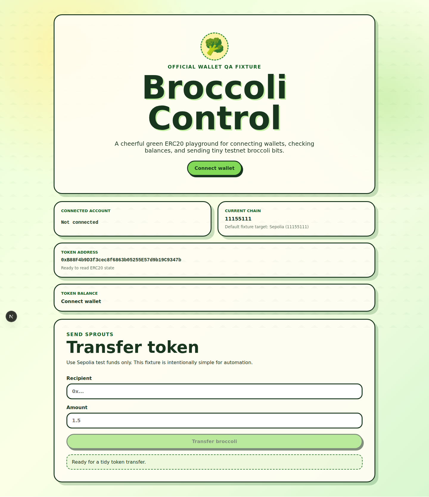
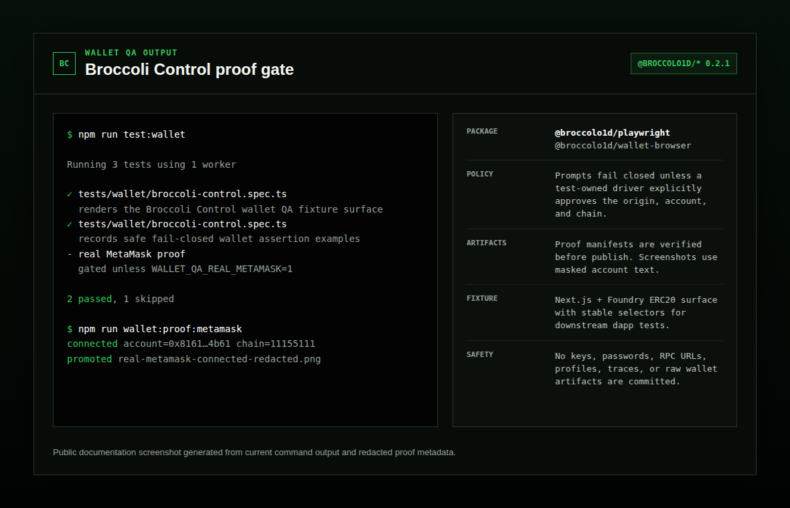

# Broccoli Control

Broccoli Control is the official public fixture dapp for `brocolli-test` wallet QA. It pairs a whimsical Next.js wallet UI with a Foundry-style ERC20 contract named **Broccoli Control Token** (`BROC`).





## Stack

- Next.js + React + TypeScript
- wagmi + viem + TanStack Query for wallet and ERC20 reads/writes
- Foundry-style Solidity project with OpenZeppelin ERC20/Ownable
- Default network: Sepolia (`11155111`)

## Wallet QA with brocolli-test

This repo imports `@brocolli-test/playwright` so the dapp owns its routes, selectors, and assertions while the package supplies wallet QA fixtures and local artifact handling.

```ts
import { expect, test } from '@brocolli-test/playwright';

test('renders the fixture surface', async ({ page, walletArtifacts }) => {
  await page.goto('/');
  await expect(page.getByTestId('connect-wallet-button')).toBeVisible();
  await walletArtifacts.screenshot('broccoli-control-home');
});
```

```bash
npm run test:wallet
```

Until the packages are published to npm, this repo vendors reviewed local `.tgz` builds under `vendor/brocolli-test/` so a fresh clone can install and run the fixture without depending on `/tmp` paths.

## Stable QA selectors

The UI intentionally exposes these stable `data-testid` hooks:

- `connect-wallet-button`
- `connected-account`
- `current-chain`
- `token-address`
- `token-balance`
- `transfer-recipient-input`
- `transfer-amount-input`
- `transfer-token-button`
- `transfer-status`

## Local frontend development

```bash
npm install
cp .env.example .env.local
# edit NEXT_PUBLIC_TOKEN_ADDRESS after deploying or point to an existing Sepolia ERC20
npm run dev
```

Open http://localhost:3000 and connect an injected browser wallet. The app reads `NEXT_PUBLIC_CHAIN_ID` and `NEXT_PUBLIC_TOKEN_ADDRESS` at build/runtime.

## Build and lint

```bash
npm run build
npm run lint
```

## Foundry setup

Install Foundry if `forge` is not available:

```bash
curl -L https://foundry.paradigm.xyz | bash
foundryup
```

Install/update the forge standard library submodule if needed:

```bash
git submodule update --init --recursive
```

Then build contracts:

```bash
npm run forge:build
# or: forge build
```

## Deploy Broccoli Control Token to Sepolia

Do **not** commit real secrets. Copy `.env.example` to `.env`, fill local values, and source them only in your shell:

```bash
cp .env.example .env
set -a
source .env
set +a
forge script script/Deploy.s.sol:Deploy --rpc-url "$SEPOLIA_RPC_URL" --broadcast -vvvv
```

If verifying on Etherscan, set `ETHERSCAN_API_KEY` and add `--verify`.

After deployment, set:

```bash
NEXT_PUBLIC_TOKEN_ADDRESS=<deployed token address>
NEXT_PUBLIC_CHAIN_ID=11155111
```

## Safety notes

- This project is for wallet QA and testnets only.
- Never use or commit production private keys.
- `.env`, Foundry `broadcast/`, `cache/`, `.next/`, and `node_modules/` are ignored.
- Deployment artifacts may reveal addresses and transaction metadata; review before sharing.

## brocolli-test integration

This repo is a downstream consumer of `brocolli-test`, not a target baked into the package. Keep app-specific routes, selectors, and assertions here; keep reusable wallet/browser behavior in `@brocolli-test/playwright` and `@brocolli-test/wallet-browser`.
