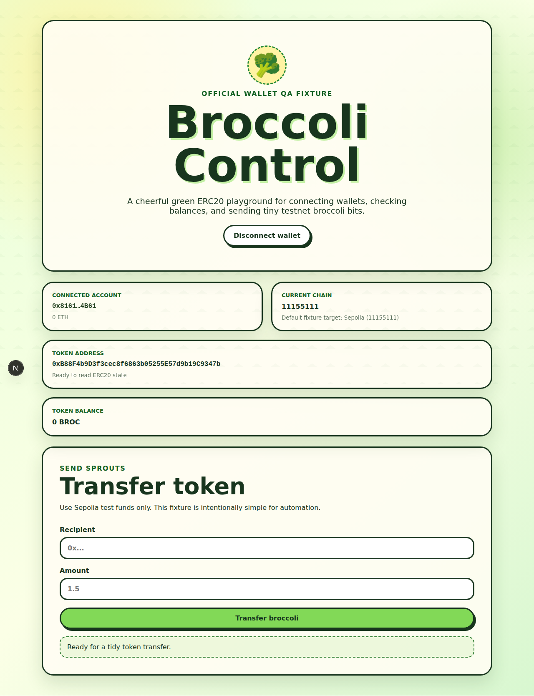
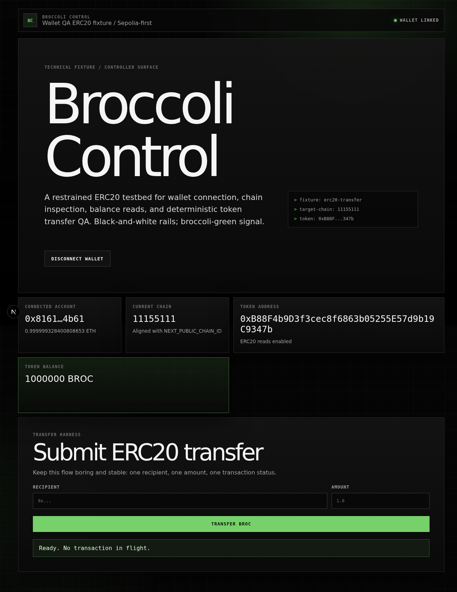
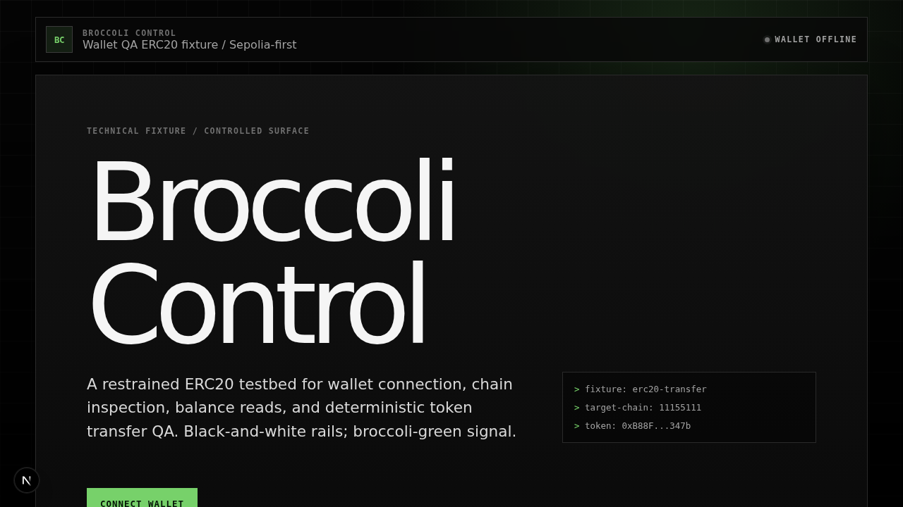

# Broccoli Control

Broccoli Control is the downstream wallet-QA fixture for the `@broccolo1d/*` browser automation packages. It is a code-first Next.js + Foundry dapp: a restrained wallet surface, stable selectors, an ERC20 contract, deterministic Playwright proofs, and gated real MetaMask evidence.

The fixture is intentionally small. The point is not feature breadth; the point is a serious product-shaped target that proves wallet automation can connect, assert origin/account/chain, write reviewable artifacts, and fail closed before approval.


## What this fixture proves

- A Next.js App Router dapp can consume `@broccolo1d/playwright` and `@broccolo1d/wallet-browser` `0.2.5` without repo-local wallet automation forks.
- Stable UI selectors expose wallet state, chain state, token configuration, transfer inputs, and transfer status for browser tests.
- Foundry owns the ERC20 fixture contract, tests, and Sepolia deployment path.
- Deterministic wallet QA writes public-safe proof manifests and screenshots in CI/local runs.
- Real MetaMask can be exercised through a gated headed Chromium profile, then promoted only as redacted documentation artifacts.
- Negative prompt assertions are recorded as examples: wrong origin, wrong account, and wrong chain reject before approval.

## Screenshots

| Local fixture | Connected wallet | Wallet QA output |
| --- | --- | --- |
|  |  |  |

| Real MetaMask proof, redacted | Fail-closed UI |
| --- | --- |
|  |  |

## Stack

- **Frontend:** Next.js App Router, React, TypeScript
- **Wallet:** wagmi, viem, TanStack Query
- **Contracts:** Solidity, Foundry, OpenZeppelin ERC20/Ownable
- **Tests:** ESLint, Next build, Playwright wallet QA, Forge tests
- **Default network:** Sepolia (`11155111`)

Reusable browser and wallet behavior belongs in `@broccolo1d/playwright` and `@broccolo1d/wallet-browser`. This repo owns only the fixture UI, selectors, contract, deployment script, and proof-promotion policy.

## Quick start

```bash
npm install
cp .env.example .env.local
npm run dev
```

Open http://127.0.0.1:3000 and connect an injected browser wallet. With the default zero token address the app renders safely but disables transfers. Set `NEXT_PUBLIC_TOKEN_ADDRESS` to a deployed ERC20 to enable balance reads and transfer submission.

### Configure a deployed token

```bash
cat > .env.local <<'EOF'
NEXT_PUBLIC_APP_NAME=Broccoli Control
NEXT_PUBLIC_CHAIN_ID=11155111
NEXT_PUBLIC_TOKEN_ADDRESS=0x0000000000000000000000000000000000000000
NEXT_PUBLIC_DEPLOYER_ADDRESS=
EOF
```

`NEXT_PUBLIC_TOKEN_ADDRESS=0x0000000000000000000000000000000000000000` is an intentional safe mode. Replace it with a reviewed testnet token address when transfer flows need to be live.

## Environment variables

Only `NEXT_PUBLIC_*` values are exposed to the browser. Do not put private keys, recovery phrases, passwords, RPC credentials, or unredacted wallet addresses into committed docs or screenshots.

| Variable | Required | Scope | Notes |
| --- | --- | --- | --- |
| `NEXT_PUBLIC_TOKEN_ADDRESS` | yes | browser | ERC20 used by the fixture. Zero address keeps transfers disabled. |
| `NEXT_PUBLIC_CHAIN_ID` | yes | browser | Expected wallet chain. Defaults to Sepolia (`11155111`). |
| `NEXT_PUBLIC_APP_NAME` | no | browser | Display/integration label. |
| `NEXT_PUBLIC_DEPLOYER_ADDRESS` | no | browser/tests | Optional expected wallet QA account; keep public docs masked. |
| `PLAYWRIGHT_BASE_URL` | no | tests | Use an existing server instead of Playwright-managed `next dev`. |
| `SEPOLIA_RPC_URL` | deploy only | shell | RPC endpoint for Foundry scripts. Never commit real values. |
| `PRIVATE_KEY` | deploy only | shell | Testnet deployer key for `forge script`. Never use production keys. |
| `ETHERSCAN_API_KEY` | verify only | shell | Optional contract verification key. |

## Stable QA selectors

The UI keeps these `data-testid` selectors stable for wallet/browser automation:

```ts
const selectors = {
  connectWallet: 'connect-wallet-button',
  connectedAccount: 'connected-account',
  currentChain: 'current-chain',
  tokenAddress: 'token-address',
  tokenBalance: 'token-balance',
  transferRecipient: 'transfer-recipient-input',
  transferAmount: 'transfer-amount-input',
  transferButton: 'transfer-token-button',
  transferStatus: 'transfer-status',
} as const;
```

Minimal Playwright smoke:

```ts
import { expect, test } from '@broccolo1d/playwright';

test('renders wallet fixture state', async ({ page }) => {
  await page.goto('/');
  await expect(page.getByTestId('connect-wallet-button')).toBeVisible();
  await expect(page.getByTestId('current-chain')).toContainText('11155111');
  await expect(page.getByTestId('transfer-token-button')).toBeDisabled();
});
```

## Wallet QA proofs

Default wallet QA is deterministic and does not touch a real wallet:

```bash
npm run test:wallet
```

The suite uses `@broccolo1d/playwright` and `@broccolo1d/wallet-browser` `0.2.5` helper APIs:

```ts
import {
  createFailClosedWalletPromptDriver,
  formatWalletQaFailure,
  verifyWalletQaProofManifest,
} from '@broccolo1d/playwright';
import { chainIdToHex, maskEthereumAddress } from '@broccolo1d/wallet-browser';
```

Committed, reviewed proof artifacts:

| Artifact | Purpose |
| --- | --- |
| [`docs/assets/wallet-qa/real-metamask-proof.json`](docs/assets/wallet-qa/real-metamask-proof.json) | Public-safe manifest from a real MetaMask run; account is masked and attachments are hashed. |
| [`docs/assets/wallet-qa/real-metamask-connected-redacted.png`](docs/assets/wallet-qa/real-metamask-connected-redacted.png) | Redacted connected-wallet screenshot promoted from the gated real run. |
| [`docs/assets/wallet-qa/fail-closed-assertion-example.json`](docs/assets/wallet-qa/fail-closed-assertion-example.json) | Example failed assertion with masked expected/actual accounts and path redaction. |
| [`docs/assets/wallet-qa/fail-closed-ui.png`](docs/assets/wallet-qa/fail-closed-ui.png) | UI screenshot attached to the fail-closed proof path. |

Representative fail-closed assertion:

```text
Wallet prompt account 0x2222…2222 does not match expected 0x1111…1111; fail closed.
```

Run the gated real MetaMask proof only from a local testnet profile:

```bash
WALLET_QA_REAL_METAMASK=1 npm run test:wallet -- --grep "real MetaMask proof"
npm run wallet:proof:metamask
```

See [docs/wallet-qa.md](docs/wallet-qa.md) for required environment variables, redaction rules, failure triage, and artifact promotion steps.

## Contract workflow

Install Foundry if needed:

```bash
curl -L https://foundry.paradigm.xyz | bash
foundryup
```

Initialize submodules if `forge-std` is missing:

```bash
git submodule update --init --recursive
```

Build and test:

```bash
forge build
forge test
```

Deploy to Sepolia only from a local shell with non-production credentials:

```bash
cp .env.example .env
# edit .env locally; do not commit real values
set -a
source .env
set +a
npm run forge:deploy:sepolia
```

The npm script runs `forge script script/Deploy.s.sol:Deploy --rpc-url $SEPOLIA_RPC_URL --broadcast --verify -vvvv`. Set `ETHERSCAN_API_KEY` when verification is required.

## Verification

Run the same gates expected in review:

```bash
npm run lint
npm run build
npm run test:wallet
npm run forge:check
```

Equivalent expanded contract checks:

```bash
forge fmt --check
forge build
forge test
```

`npm run test:wallet` starts a local Next.js server through Playwright unless `PLAYWRIGHT_BASE_URL` points at an already running app.

## Documentation

- [Wallet QA runbook](docs/wallet-qa.md)
- [Deployment notes](docs/deployment.md)

## Safety

- Testnets only; do not use production keys.
- `.env`, `.env.*`, Foundry `broadcast/`, `cache/`, `.next/`, Playwright reports, wallet artifacts, and `node_modules/` are ignored.
- Review every generated PNG and JSON file before sharing.
- Public artifacts must not include seeds, private keys, passwords, RPC URLs, full private wallet addresses, or full local paths.
